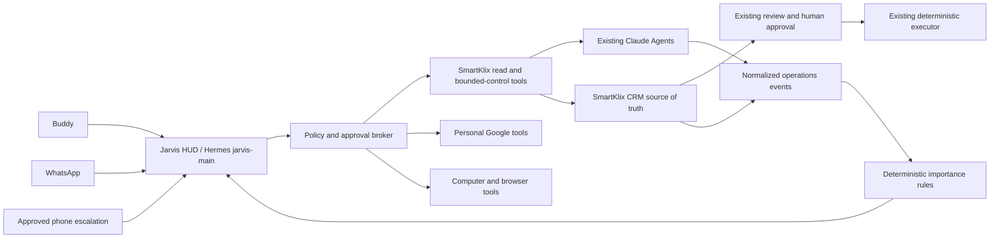

# Jarvis general operator roadmap

Date: 2026-09-28

Status: architecture and implementation order only. This document does not grant
new send, spend, call, approval, deployment, or computer-control authority.

## Decision

The case studies should extend the existing `jarvis-main` Hermes session. They
do not justify another agent framework, another operations-manager agent, or a
second CRM/workflow system.

The target remains:



Jarvis/Hermes holds the Operations Manager role. Existing agents remain the
workers. SmartKlix CRM remains the business source of truth. Existing review,
human approval, and deterministic execution remain authoritative.

## What exists today

### Jarvis/Hermes

- The HUD and voice bridge use the persistent `jarvis-main` session.
- The read-only `get_smartklix_operations` MCP tool is implemented and exposes
  no write, approval, send, execution, or spend method.
- Hermes v0.21.0 is installed locally. The upstream main branch has moved far
  beyond that release, so upgrading must be a separate compatibility project;
  this roadmap does not upgrade it.
- The installed Hermes version already includes WhatsApp, incoming WhatsApp
  voice transcription, WhatsApp TTS delivery, `/stop`, scheduled jobs, webhook
  inputs, HMAC verification, cross-platform session handoff, session search,
  memory, toolsets, and per-session model selection.
- The supported `/handoff whatsapp` flow can transfer the current session ID,
  transcript, and tool history to WhatsApp. The remote experience must bind to
  `jarvis-main` through that flow instead of silently creating a second Jarvis
  conversation.
- Approval mode is `manual`; cron authority is denied.
- The Hermes gateway is currently stopped. WhatsApp and webhook credentials are
  not configured. No cron jobs exist.
- Computer Use is present as a Hermes tool, but `cua-driver` is not installed on
  either Windows or WSL. It is therefore unavailable today.
- Local memory and FTS5 `session_search` already cover conversational recall.
  They should be used before adding a vector-memory product.

### SmartKlix CRM

- `GET /api/jarvis/operations` is implemented as a dedicated authenticated,
  read-only snapshot route.
- The route includes leads, research-relevant CRM state, drafts/proposals,
  approvals, sends, replies, failures, calls/intake, meetings, revenue, and
  safety-control status where the underlying records exist.
- The production route still needs deployment and matching read-token
  configuration before Jarvis has live CRM visibility.
- Retell inbound receptionist intake already exists with signed webhook
  verification, idempotent receipts, bounded recovery, retained failures, and
  manual review boundaries.
- Retell currently has no general CRM lookup or booking authority. Appointment
  requests remain intake for a human-controlled Calendar action.
- SmartKlix contains outbox/audit/event evidence that can feed Jarvis. We should
  add an adapter over these records, not replace them with a new event store.

### Existing outreach workers

The authoritative repository is
`C:\Users\jovan\Downloads\smart klix claude agents`, branch
`fix/vercel-first-runtime`, current commit `5cddf1e`. It contains the existing
bounded Hermes researcher, source-backed qualification, unsent drafting, Redis
identity/territory records, operator review UI, execution receipts, and the
trusted handoff boundary toward CRM.

The approved supervised startup is `npx tsx scripts/local-research.ts`, which
serves the loopback application on port 3001. `npm start` invokes the retained
legacy autonomous bootstrap and is not an approved startup path. Outbound
delivery remains off.

The Jarvis read adapter targets the existing GET surfaces for metrics, workers,
activity, usage, executions, research, and territory work. The loopback service
is not running or reachable at the time of this audit. Jarvis must continue
reporting that source as unavailable rather than estimating activity.

### Telemetry gaps

No authoritative ledger currently joins all of the following by Buddy objective:

- budget allocated, reserved, spent, and remaining;
- provider-billed model cost;
- research/enrichment cost per prospect;
- STT, TTS, phone, and delivery cost;
- durable worker and end-to-end runtime;
- cost adjustments or late provider reconciliation.

Local token counts and provider-specific records are evidence inputs, but they
are not yet one reconciled business budget.

## Repository and package decisions

| Capability | Decision | Reason |
| --- | --- | --- |
| Core agent, WhatsApp, cron, webhooks, memory | Keep `NousResearch/hermes-agent` already installed | These are native features. A new orchestration repo would duplicate the runtime and split `jarvis-main`. |
| Jarvis HUD | Keep this repository | It already owns the approved HUD, voice, STOP/barge-in, approvals, tool visualization, and SmartKlix read bridge. |
| SmartKlix operations | Keep the CRM and existing Claude Agents repositories | They own business state, worker execution, review, and delivery. |
| Windows computer control | Use Hermes's built-in adapter with official `trycua/cua` `cua-driver` | It supports Windows screenshots, accessibility trees, background actions, bounded capability manifests, and explicit failures. Install the released driver; do not fork or embed the whole Cua repo. |
| Phone calls | Reuse the existing Retell/Twilio boundary | SmartKlix already receives Retell calls safely. For future owner calls, use Retell's official SDK/API through a narrow server tool. Do not enable the broad Retell MCP or direct model access to arbitrary phone calls. |
| Gmail and Calendar | Use Google's official APIs behind narrow local tools | Hermes has a Google Workspace skill, but the current generic setup asks for broader scopes than this rollout needs. Begin with Calendar free/busy/events-read and Gmail metadata/read-only as separately authorized tools. |
| Alerts | Use SmartKlix events/outbox plus Hermes signed webhooks and WhatsApp delivery | This is already sufficient. A general event-orchestration platform would add another control plane. |
| Model routing | Use Hermes provider/model overrides and a small policy table | Easy scheduled/background work can pin a cheap model. Keep the live operator model replaceable. Do not add another visible agent. |
| Second brain | Pilot Hermes's native OpenViking provider against curated SmartKlix/Jarvis documents | OpenViking matches the desired file-hierarchy, tiered-loading, semantic-retrieval experience without replacing Hermes. Keep FTS5 session search and built-in memory alongside it. |

No outside repository should be cloned for the first four milestones. The first
new binary worth installing is `cua-driver`, and only when the computer-control
milestone begins.

## Event and interruption design

Every event entering Jarvis should use one small normalized envelope:

```json
{
  "eventId": "source-stable-id",
  "occurredAt": "2026-09-28T12:00:00Z",
  "source": "smartklix-crm",
  "type": "approval.blocking",
  "subject": { "type": "proposal", "id": "..." },
  "facts": {},
  "severity": "attention",
  "requiresBuddy": true,
  "dedupeKey": "approval:proposal-id",
  "evidenceUrl": null
}
```

Classification should be deterministic first:

| Severity | Examples | Delivery |
| --- | --- | --- |
| `info` | research completed, routine send receipt | store for status summaries; no interruption |
| `attention` | approval waiting, qualified reply, recoverable worker failure | WhatsApp/HUD during allowed hours, deduped |
| `urgent` | repeated system failure, signed deal, payment, explicit urgent customer issue | immediate WhatsApp; phone escalation only under a later standing rule |

The rule engine must support deduplication, cooldowns, quiet hours, acknowledgement,
and escalation timeout. It should not ask an LLM to classify every routine event.
An inexpensive classifier may resolve ambiguous text only after deterministic
rules fail, and its output cannot grant execution authority.

## How real the second brain is

Three memory layers already exist, but they solve different problems:

| Layer | What is real today | Limit |
| --- | --- | --- |
| Built-in memory | Compact stable facts in `MEMORY.md` and `USER.md`, injected into each turn | Intentionally small; not a document library |
| Session search | FTS5 search over actual Hermes messages and tool history | Keyword/full-text retrieval, not broad semantic document search |
| Project context | Progressive loading of `.hermes.md`, `AGENTS.md`, `CLAUDE.md`, and related project instructions | Loads selected context files; it does not index every project document automatically |

OpenViking is the closest match to the demonstrated file-distribution idea. The
Hermes integration is already bundled as a memory provider. OpenViking adds:

- a `viking://` hierarchy for resources, memories, and skills;
- semantic search plus visible file/tree navigation;
- L0 abstracts, L1 overviews, and L2 full content loaded on demand;
- URL and document ingestion;
- automatic memory extraction when a session is committed;
- retrieval traces that can be inspected when the wrong file is selected.

That capability is real, but it is not magic. It requires a separate OpenViking
server, embedding/model configuration, an ingestion manifest, refresh rules,
access boundaries, backups, and measured retrieval tests. It must not crawl the
whole computer. Credentials, `.env` files, raw customer exports, private mailbox
content, database dumps, generated dependencies, and archived evidence stay out
of the index unless a later policy explicitly admits a narrow source.

The first pilot should ingest only reviewed architecture, product, operating,
and project documents from Jarvis, Smart Klix Claude Agents, and SmartKlix CRM.
The pilot must compare OpenViking with ordinary file search and Hermes session
search on a fixed question set. It passes only when answers identify their
source, stale documents are detectable, deletions actually disappear, and
retrieval is materially better than the existing tools.

OpenViking is AGPL-3.0. Internal evaluation can proceed in isolation; any future
customer packaging or hosted offering needs an explicit licensing and source-
distribution review before it becomes part of the commercial product.

## Permission boundary

| Action | Initial policy |
| --- | --- |
| Read operations, search history, calculate summaries | autonomous |
| Read Gmail/Calendar after account authorization | autonomous within the explicit read scope |
| Draft a personal email or calendar change | prepare and show Buddy |
| Send personal email, create/update calendar event | explicit approval until a narrower standing rule exists |
| Start/pause bounded existing outreach workflow | disabled until the read-only milestone is accepted, then policy-token controlled |
| Business outreach send | only through existing CRM review/approval/executor |
| Outbound phone call | disabled; later explicit recipient/purpose/budget authorization |
| Computer click/type | bounded manifest; sensitive or consequential actions require approval |
| Purchase, payment, production deploy, deletion, auth/security change | explicit approval |

## Implementation order

### Milestone 0 - activate and verify the existing eyes

1. Deploy the existing SmartKlix read-only route.
2. Configure matching 32+ character CRM/Jarvis read tokens without exposing them
   to the browser or source control.
3. Build the existing outreach UI, start Redis and the approved supervised
   `scripts/local-research.ts` server, then verify every expected read endpoint.
4. Run live read-only questions through `jarvis-main` and confirm that CRM,
   worker, and Jarvis usage data are labeled by source and time window.
5. Add no write tool.

Acceptance: Buddy can ask the agreed operations questions and each answer either
cites current authoritative data or explicitly names the unavailable source.

### Milestone 1 - controlled second-brain pilot

Run OpenViking as a separate local service and connect it through Hermes's
bundled provider. Create a reviewed ingestion manifest for a small set of Jarvis,
Smart Klix Claude Agents, and SmartKlix CRM documents. Exclude secrets, customer
records, generated files, dependencies, and archives. Evaluate a fixed set of
cross-project questions against file search, session search, and OpenViking.

Acceptance: the provider returns source-identifiable answers, the filesystem
hierarchy is inspectable, stale/deleted documents are handled correctly, and it
beats existing retrieval enough to justify another local service.

### Milestone 2 - bounded SmartKlix hands

Create separate narrow tools for specific existing controls such as pause an
objective, resume an already-approved objective, or start a bounded existing
workflow. Use idempotency keys, objective limits, audit receipts, and
server-side authorization. Do not expose generic HTTP, SQL, approval, or send.

Acceptance: every command is attributable, repeat-safe, within limits, visible
in CRM/audit history, and rejected when authority or an objective limit is absent.

### Milestone 3 - WhatsApp remote access to the same Jarvis

Current status (2026-09-30): the bundled bridge dependencies are installed and
its 22 tests pass. A locked-down local configuration is prepared with WhatsApp
disabled until pairing, DM allowlisting, groups disabled, and allow-all off.
The remaining first-proof step is Buddy's interactive QR pairing, followed by
the `jarvis-main` handoff and acceptance checks documented in
`JARVIS-WHATSAPP-ROLLOUT.md`.

Use Hermes's existing WhatsApp integration; do not add a separate messaging
agent. For a quick internal proof, the Baileys bridge can link an existing
WhatsApp account without a Meta developer application, but it is unofficial,
holds powerful linked-device credentials, and carries account-restriction risk.
The durable business path is WhatsApp Cloud API on a dedicated business number,
which requires Meta setup and a public signed webhook.

Whichever path is chosen, allowlist only Buddy, silently ignore unauthorized
DMs, resume the actual `jarvis-main` session, and use `/handoff whatsapp`. Start
with read-only SmartKlix tools. Verify voice-note transcription, text replies,
TTS voice reply, `/stop`, restart persistence, and handoff back to the HUD/CLI.

Acceptance: the session ID and remembered context survive the handoff; an
unauthorized WhatsApp account cannot interact with the bot; no bulk or customer
messaging authority is enabled.

### Milestone 4 - proactive alerts

Current status (2026-09-30): deterministic event normalization plus local
dedupe, cooldown, and quiet-hour policy are implemented behind the read-only
`get_smartklix_attention` MCP tool. External delivery remains disabled until
WhatsApp pairing and the synthetic delivery acceptance test. See
`JARVIS-SMARTKLIX-ATTENTION-ENGINE.md`.

Expose a signed SmartKlix event adapter to Hermes webhooks. Implement the
deterministic severity policy, dedupe/cooldown ledger, quiet hours, and WhatsApp
delivery. Begin with synthetic events, then supervised real read-only events.

Acceptance: routine events remain quiet; duplicate events do not cause duplicate
alerts; urgent synthetic events reach Buddy once with evidence and a clear next
decision; no event can bypass CRM approval/execution.

### Milestone 5 - Calendar and personal Gmail

Add separate OAuth clients/scopes and separate read/write tools. Calendar starts
with free/busy or event-read access. Gmail starts with the least access that
supports the accepted use case. Sending and event creation remain approval-gated.
Business outreach email never uses this path.

### Milestone 6 - owner phone escalation and background continuation

Add a narrow Retell call tool for Buddy's verified number only, with a daily
cost cap, allowed reasons, quiet hours, explicit call receipts, STOP, and signed
post-call events. Convert the spoken decision into a pending audited action and
continue through the same policy broker after the call ends.

Do not reuse the public receptionist agent as the owner-operations agent. Reuse
the provider and signed webhook infrastructure, with a separately scoped Retell
agent/configuration.

### Milestone 7 - computer and screen control

Install the official released `cua-driver` on Windows, run `doctor`, and connect
Hermes's existing `computer_use` tool. Start with read-only window inventory and
screen inspection, then a bounded capability manifest for approved apps/actions.
Prefer APIs and dedicated tools whenever available.

### Milestone 8 - reflex and model routing

Measure latency and cost first. Use deterministic routing for domain/tool/approval
decisions. Pin cheap models for scheduled summaries and bounded classifications;
retain the selected main model for complex operator reasoning. Voice endpointing
belongs in the audio pipeline, not in a second agent.

### Milestone 9 - objective and budget ledger

Defer the combined ledger until provider choices and real prices are stable
enough to model. When that evidence exists, add a small append-only ledger tied
to a Buddy objective. Store allocations, reservations, provider usage evidence,
reconciled charges, runtime, and remaining budget. The ledger references existing
run/task/lead IDs and does not own leads, proposals, approvals, or execution.

Acceptance: `allocated = available + reserved + spent` can be reconciled, late
provider charges are adjustments rather than rewrites, and work stops before a
hard limit is exceeded. Until then, report available usage facts and label cost
or remaining budget as unknown.

### Later bucket

Focus/accountability mode, camera input, gesture control, and holographic display
work remain later features after the operator loop is reliable and measurable.

## First implementation package

The next code task should be only Milestone 0. Its deliverable is a live,
read-only operations acceptance report covering:

- CRM route deployment and authentication;
- local outreach endpoint health;
- Jarvis MCP discovery from `jarvis-main`;
- answers for current work, attention, leads, drafts, approvals, sends, replies,
  failures, worker status, and one lead lookup;
- existing usage facts labeled honestly, with cost/runtime gaps left for the
  final accounting milestone;
- regression tests for the HUD, voice, STOP, approvals, and SmartKlix snapshot.

Only after that report passes should implementation move to the controlled
second-brain pilot, proactive alerts, and bounded operations controls.

## Risks to carry forward

1. **Hermes upgrade delta.** The installed v0.21.0 checkout is materially behind
   upstream main. Do not mix an upgrade into an integration milestone. Audit and
   test a tagged release in isolation when an upgrade is approved.
2. **Session split.** A new WhatsApp conversation is not automatically
   `jarvis-main`. Use the supported handoff and verify the actual session ID.
3. **False budget confidence.** Token counts are not provider-billed cost. Do not
   report a remaining budget until the ledger reconciles real charges.
4. **Inbound versus outbound phone authority.** Existing Retell intake proves a
   safe inbound path. It does not authorize outbound calling.
5. **OAuth scope expansion.** Gmail read/compose scopes are sensitive or
   restricted. Separate internal-use setup from any future customer product and
   plan verification/security requirements before commercialization.
6. **Computer-use fallbacks.** Windows background control is best effort; some
   apps require foreground input. Every consequential action still needs
   independent policy checks and post-action verification.
7. **Dormant outreach bootstrap.** `npm start` in Smart Klix Claude Agents is a
   legacy autonomous path. Jarvis setup must use the documented supervised
   server and must not activate that scheduler as a shortcut.
8. **WhatsApp transport choice.** The personal-account bridge is convenient but
   unofficial and powerful. WhatsApp Cloud is official but needs a dedicated
   business number, Meta configuration, a public webhook, and template rules.
   Do not hide this tradeoff behind a generic "WhatsApp enabled" checkbox.
9. **Knowledge indexing boundary.** A second brain can leak secrets or stale
   business facts if ingestion is broad or deletion is incomplete. Use an
   allowlisted manifest and keep CRM live facts in CRM.

## Research references

- Hermes Agent repository and supported platforms:
  <https://github.com/NousResearch/hermes-agent>
- Hermes scheduled jobs and event-triggered runs:
  <https://github.com/NousResearch/hermes-agent/blob/main/website/docs/user-guide/features/cron.md>
- Hermes WhatsApp gateway and voice messages:
  <https://github.com/NousResearch/hermes-agent/blob/main/website/docs/user-guide/messaging/whatsapp.md>
- Hermes WhatsApp Business Cloud API adapter:
  <https://github.com/NousResearch/hermes-agent/blob/main/website/docs/user-guide/messaging/whatsapp-cloud.md>
- Hermes memory providers:
  <https://hermes-agent.nousresearch.com/docs/user-guide/features/memory-providers/>
- OpenViking repository:
  <https://github.com/volcengine/OpenViking>
- Cua Driver repository and Windows support:
  <https://github.com/trycua/cua>
- Retell official Python SDK:
  <https://github.com/RetellAI/retell-python-sdk>
- Retell phone-call API:
  <https://docs.retellai.com/api-references/create-phone-call>
- Google Calendar OAuth scopes:
  <https://developers.google.com/workspace/calendar/api/auth>
- Gmail OAuth scopes:
  <https://developers.google.com/workspace/gmail/api/auth/scopes>
