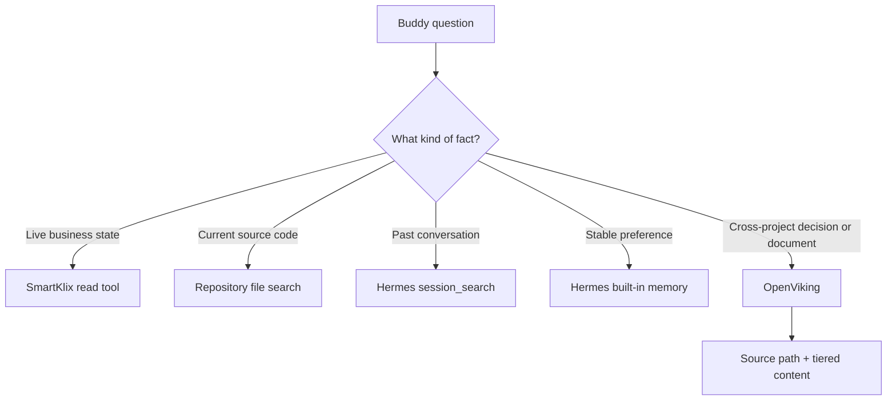

# Jarvis second-brain pilot

Date: 2026-09-28

Status: implementation specification. Run after the current SmartKlix read-only
eyes are live and accepted.

## Purpose

Give the existing `jarvis-main` Hermes session structured, searchable knowledge
across Jarvis, Smart Klix Claude Agents, and SmartKlix CRM without copying live
CRM state or creating another agent.

## Selected foundation

Use the OpenViking memory provider already bundled with Hermes. OpenViking runs
as a separate local service and exposes hierarchical resources through
`viking://` paths. Hermes supplies native tools for semantic search, tiered
reading, filesystem-style browsing, explicit memory, deletion, and resource
ingestion.

Keep these existing layers:

- built-in Hermes memory for compact stable facts and Buddy preferences;
- Hermes FTS5 session search for exact conversation/tool history;
- repository file tools and `rg` for current source code;
- SmartKlix read tools for live operational/business facts;
- OpenViking for cross-project documents, decisions, runbooks, and architecture.

OpenViking does not become the source of truth for leads, proposals, approvals,
sends, replies, runtime state, or credentials.

## Retrieval routing



Jarvis may combine results, but it must label their source and timestamp. A
retrieved document cannot override newer live CRM data.

## Initial hierarchy

```text
viking://resources/smartklix/
  jarvis/
    architecture/
    production-readiness/
    operator-roadmap/
  claude-agents/
    active-architecture/
    research-workflow/
    review-and-delivery/
    operating-runbooks/
  crm/
    active-architecture/
    agent-authority/
    approval-and-execution/
    intake-and-recovery/
    feature-status/
```

The hierarchy is a view for retrieval. Original files remain in their existing
repositories and remain authoritative.

## Allowlisted sources

The pilot uses an explicit manifest. Eligible files are reviewed Markdown/text
documents describing current architecture, permissions, operating procedures,
accepted checkpoints, and product decisions.

Start with documents such as:

- Jarvis `docs/ARCHITECTURE.md`, `docs/PRODUCTION-READINESS.md`, and the operator
  roadmap;
- Smart Klix Claude Agents `ACTIVE-ARCHITECTURE.md`,
  `CURRENT-SYSTEM-AND-JARVIS-PLAN-20260925.md`, current handoff/checkpoint files,
  and reviewed Hermes research documentation;
- SmartKlix CRM current architecture, feature-status, agent-authority,
  approval/execution, intake, recovery, and Jarvis integration documents.

Do not recursively ingest an entire repository during the pilot.

## Always excluded

- `.env`, credentials, tokens, keys, cookies, WhatsApp sessions, and auth files;
- customer/prospect exports, inbox bodies, transcripts, recordings, CRM dumps,
  and private evidence;
- `.git`, `node_modules`, virtual environments, builds, caches, test failures,
  generated graphs, and packed repository dumps;
- archived/superseded documents unless one is explicitly labeled historical and
  needed to explain a decision;
- live databases and provider payloads.

## Ingestion record

Each indexed resource must record:

- original absolute path and repository;
- Git commit when available;
- content SHA-256;
- document status: `current`, `historical`, or `superseded`;
- indexed timestamp;
- owner/system;
- sensitivity classification;
- replacement path for superseded documents.

Re-index only when the content hash changes. Removal from the manifest must
remove the corresponding OpenViking resource and verify that search no longer
returns it.

## Evaluation

Create at least 20 fixed questions covering:

- current Jarvis architecture and production gaps;
- which system owns CRM approval and execution;
- how Smart Klix prospect research starts and stops;
- which startup path is supervised and which is dormant;
- what Retell can and cannot do;
- where a current implementation decision was documented;
- what is live state versus an architectural document;
- one deliberately ambiguous query and one superseded-document trap.

Run each question through:

1. repository/file search plus Hermes session search;
2. OpenViking retrieval;
3. a reviewer that sees only the question, returned sources, and expected facts.

The pilot passes when:

- every factual answer names the originating file or live tool;
- no excluded file or secret appears in an index or result;
- current documents outrank explicitly superseded ones;
- removed resources disappear from retrieval;
- OpenViking improves correct source selection over the baseline on the fixed
  questions;
- retrieval failures are visible through the returned search path instead of
  being disguised as confident answers;
- the service survives restart without re-ingesting unchanged documents.

## Implementation package

1. Pin a reviewed OpenViking release and record its AGPL-3.0 license.
2. Run it in an isolated local environment or container, separate from Hermes's
   Python environment.
3. Run OpenViking initialization and doctor checks.
4. Configure the existing Hermes provider for local loopback access.
5. Add the reviewed ingestion manifest and deterministic sync script.
6. Ingest the initial document set.
7. Run the fixed evaluation and export a result report.
8. Leave the provider disabled if it does not beat the existing retrieval stack.

Do not upload the pilot corpus to a hosted memory provider. Do not enable
automatic ingestion from arbitrary user folders. Do not package OpenViking for a
customer until the commercial license/distribution boundary has been reviewed.

## Evidence required before adoption

- exact OpenViking version and image/package checksum;
- doctor and restart results;
- manifest plus indexed content hashes;
- excluded-path scan;
- evaluation questions, expected facts, retrieved paths, and scores;
- deletion/staleness proof;
- measured storage, retrieval latency, and any embedding/model cost;
- rollback steps that return Hermes to built-in memory only.
